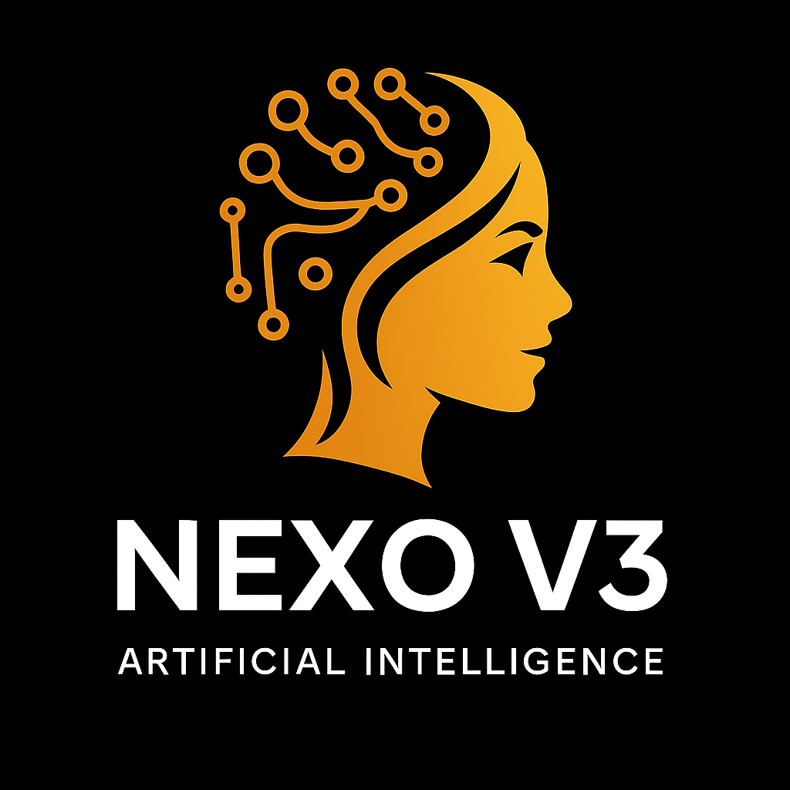

<div align="center">

# 🌌 NEXO V3 — Next-Generation Autonomous AI Coding & Design Workspace

[](https://github.com/chetan3232/Nexo-V3-ai/stargazers)
[](https://github.com/chetan3232/Nexo-V3-ai/network/members)
[](https://github.com/chetan3232/Nexo-V3-ai/blob/main/LICENSE)
[](https://github.com/chetan3232/Nexo-V3-ai/issues)

[✨ Try the Live Demo](https://nexo--ai.site) | [🖥️ Get Desktop App](#option-b-running-as-an-electron-desktop-application) | [📖 Read Run Guide](#🚀-installation--run-guide)

<p align="center">
  
</p>

**Nexo V3** is a futuristic, next-generation AI companion IDE. Inspired by VS Code, Cursor, Windsurf, Devin, and Lovable, Nexo V3 provides a unified, glassmorphic visual development cockpit supporting local AI orchestration, multi-agent debates, sandboxed execution runtimes, and live visual diff code approvals.

</div>

---

## 🎯 Product Vision & Core Architecture

Nexo V3 is structured around a stable, modular, progressive development pipeline, combining state-of-the-art developer UX with real-time AI agents:

*   🔒 **Secure Firebase Authentication**: Built-in Google authentication supporting session restore, custom user profiles (avatar, UID, display name), re-authentication checks, and permanent account deletions.
*   💾 **State & Preference Persistence**: Preserves and restores user preferences (font size, word wrapping, auto-save settings, layout panel sizes) and recently opened workspace projects automatically.
*   🧠 **Planner Agent**: Converts broad natural language prompts into step-wise filesystem plans before writing any code.
*   🔍 **Context Engine**: Injects open tabs, cursor selection ranges, active terminal logs, compiler errors, and workspace directory structures directly into LLM prompts.
*   🛠️ **Tool Calling System**: Permits agents to read/write files, create folders, execute terminal commands, and query vector memories autonomously.
*   ⚖️ **Visual Diff Approvals (Antigravity Mode)**: Stages proposed code changes side-by-side using Monaco Diff Editors, allowing developers to explicitly `Accept` or `Reject` changes before writing to disk.
*   🚀 **Cloud Sync Ready**: Pre-wired sync interfaces to back up settings, workspaces, and chat conversations to cloud databases.
*   ⏳ **Live AI Timeline**: Logs chronological workspace modifications, compiler checkouts, and runtime logs directly in the sidebar panel.

---

## 📸 Screenshots & Visuals

Here is a glimpse of the NEXO V3 workspace in action:

<div align="center">
  <table>
    <tr>
      <td><strong>Premium Coding Cockpit</strong></td>
      <td><strong>Visual Diff Editor approvals</strong></td>
    </tr>
    <tr>
      <td></td>
      <td></td>
    </tr>
  </table>
</div>

*Note: Screenshots can be found in the `/assets/screenshots/` folder.*

---

## 🛠️ Technology Stack

Nexo V3 uses a premium, modern, and highly performant technology stack:

### Frontend


### Backend & Databases


### Runtime & Packaging


---

## 🏗️ Folder Architecture

```txt
nexo-v3/
 ├── backend/           # Core API & Gateway Server
 │    ├── agents/       # Autonomous task loop plan orchestrators
 │    ├── ai/           # LLM Prompts & token streaming configurations
 │    ├── database/     # Supabase SQL schemas & PostgreSQL connection setups
 │    ├── deploy/       # Vercel, Netlify, Cloudflare Wrangler builders
 │    ├── memory/       # Cosine-similarity vector math calculations
 │    ├── routes/       # Express API controllers (auth, files, projects, memories)
 │    ├── runtime/      # Docker container isolated runtimes
 │    ├── terminal/     # PowerShell/Shell PTY runners
 │    ├── websocket/    # Real-time multiplexing stream gateway
 │    └── index.js      # Main Express application bootloader
 └── src/               # Client React Application
      ├── auth/         # 🔐 Firebase Authentication & Session Sync Engine
      ├── agents/       # Frontend planning scripts
      ├── ai/           # Context engines & tool execution clients
      ├── components/   # Modular layout items & UI widgets
      ├── editor/       # Monaco Editor tabs and workspace canvas items
      ├── services/     # Backend REST & WebSocket connection clients
      ├── store/        # Zustand state stores (FileSystem, Editor, Chat, Timeline)
      ├── styles/       # Global CSS & glassmorphic aesthetics config
      ├── workspace/    # Primary IDE workspace layout
      └── main.tsx      # React web app entrypoint
```

---

## 🚀 Installation & Run Guide

### 1. Prerequisites & Environment Configuration
Clone the repository and install dependency packages:
```bash
git clone https://github.com/chetan3232/Nexo-V3-ai.git
cd Nexo-V3-ai
npm install
```

Create a `.env` file in the root directory:
```env
# Nexo Server Port (Default: 8787)
NEXO_API_PORT=8787

# Supabase Configurations (Boots in mock mode if undefined)
SUPABASE_URL=your_supabase_project_url
SUPABASE_SERVICE_ROLE_KEY=your_supabase_service_role_key

# NVIDIA NIM API Keys (Required for AI actions)
NVIDIA_API_KEY=your_nvidia_api_key
VITE_NVIDIA_API_KEY=your_nvidia_api_key

# Firebase Authentication Configurations (Runs in mock mode if empty)
VITE_FIREBASE_API_KEY=your_firebase_api_key
VITE_FIREBASE_AUTH_DOMAIN=your_firebase_auth_domain
VITE_FIREBASE_PROJECT_ID=your_firebase_project_id
VITE_FIREBASE_STORAGE_BUCKET=your_firebase_storage_bucket
VITE_FIREBASE_MESSAGING_SENDER_ID=your_firebase_messaging_sender_id
VITE_FIREBASE_APP_ID=your_firebase_app_id
VITE_FIREBASE_MEASUREMENT_ID=your_firebase_measurement_id
```

---

### 2. How to Run Nexo V3

You can launch Nexo V3 across multiple targets: Web (Standard browser layout) or Desktop (Electron / Tauri wrapper layers).

#### Option A: Running as a Web Application (Recommended for Dev)

1.  **Start the Backend API & WebSockets Gateway Server** (runs on port `8787`):
    ```bash
    npm run dev:server
    ```
2.  **Start the Frontend Client UI** (runs on port `3000` via Vite):
    ```bash
    npm run dev
    ```
3.  Open [http://localhost:3000](http://localhost:3000) in your web browser.

#### Option B: Running as an Electron Desktop Application

1.  **Ensure Vite Dev Server is running** on port `3000`:
    ```bash
    npm run dev
    ```
2.  **Ensure Backend Gateway Server is running** on port `8787`:
    ```bash
    npm run dev:server
    ```
3.  **Boot the Electron window** (automatically bridges OS filesystem & native terminal integrations):
    ```bash
    npm run desktop:dev
    ```

#### Option C: Running as a Tauri Application
If you prefer light rust-compiled desktop window binaries:
1.  Make sure cargo/Rust compiler tools are installed.
2.  Boot dev target:
    ```bash
    npm run tauri:dev
    ```

---

## 🗺️ Project Roadmap

- [x] **Phase 1: Monaco Integration & Terminal PTY** - Solid terminal communication and syntax-highlighted coding tabs.
- [x] **Phase 2: Google Sign-In & Session Persistence** - Firebase Auth integration, user profiles, and automatic preference restoration.
- [ ] **Phase 3: Multi-Agent Collaboration Debates** - Multiple subagents verifying and analyzing code changes in real-time.
- [ ] **Phase 4: Remote Workspace Sharing** - Real-time multiplayer peer-to-peer coding sessions.

---

## 🤝 Contributing

Contributions are welcome! Please read the contribution guidelines:
1. Fork the Project.
2. Create your Feature Branch (`git checkout -b feature/AmazingFeature`).
3. Commit your Changes (`git commit -m 'Add some AmazingFeature'`).
4. Push to the Branch (`git push origin feature/AmazingFeature`).
5. Open a Pull Request.

---

## 📄 License

Distributed under the MIT License. See `LICENSE` for more information.
